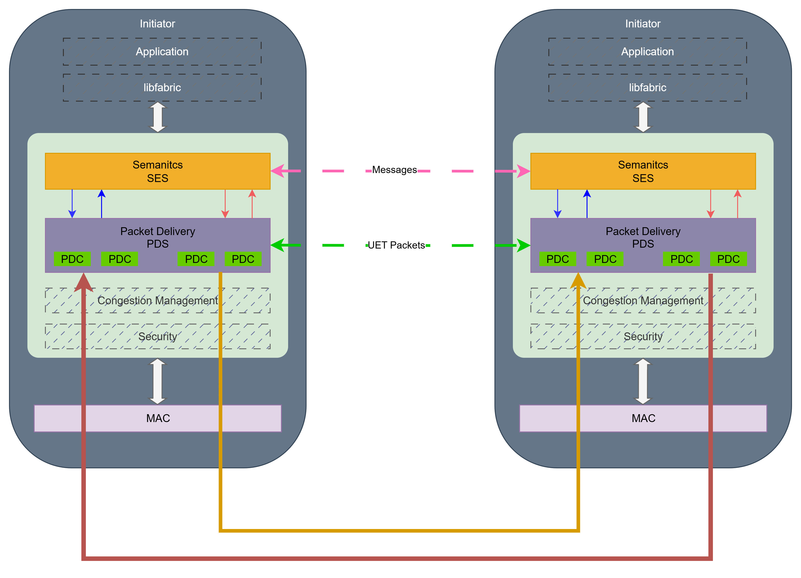
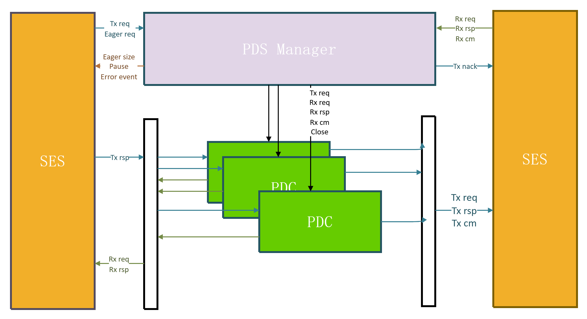

# **Soft**-UE: Software Prototype of Ultra Ethernet

---


[](https://www.apache.org/licenses/LICENSE-2.0)[](https://ubuntu.com/download)[](https://ultraethernet.org/)


- [**Soft**-UE: Software Prototype of Ultra Ethernet](#soft-ue-software-prototype-of-ultra-ethernet)
  - [Soft-UE Overview](#soft-ue-overview)
  - [System Architecture](#system-architecture)
    - [Core Components](#core-components)
  - [Repository Structure](#repository-structure)
  - [Getting Started](#getting-started)
    - [System Requirements](#system-requirements)
    - [Install](#install)
    - [Test Run](#test-run)
      - [PDSTest](#pdstest)
      - [SESTest](#sestest)
    - [Writing Your Own Test Cases](#writing-your-own-test-cases)
  - [Community Contribution](#community-contribution)
  - [Contact Us](#contact-us)


## Soft-UE Overview

Soft-UE is a software prototype of Ultra Ethernet Specification.  Ultra Ethernet is a specification of new protocols for use over Ethernet networks and optional enhancements to existing Ethernet protocols that improve performance, function, and interoperability of AI and HPC applications. The Ultra Ethernet  specification covers a broad range of software and hardware relevant to AI and HPC workloads: from the API supported by UE-compliant devices to the services offered by the transport, link, and physical layers, as well as management, interoperability, benchmarks, and compliance requirements. This project aims to help open-source community developers better understand the Ultra Ethernet Specification while verifying its correctness and feasibility.

**Current Release:** SoftUE v1.0.0

## System Architecture



### Core Components



- **SES (Semantic Sub-layer)**: Defines endpoint addressing, authorization, message types, protocols, and semantic header formats. Operating at the transaction level (messages or RMAs), this sub-layer breaks down each transaction into multiple packets for transmission.
- **PDSManager**: Manages the full lifecycle of PDCs and coordinates all network I/O operations. When an SES request (REQ/RSP) is received, it schedules the appropriate PDC to perform the data transfer and handles packet mismatches as well as network-level exceptions.

- **PDC (Packet Delivery Context)**: Handles the setup, teardown, and encapsulation of a single connection, maintaining sequence numbers and acknowledgments (ACKs) to ensure reliable, in-order delivery.

## Repository Structure

 ```
 UET/src/
 ├── SES/
 │   ├── SES.hpp          # SES module interface and data structures
 │   └── SES.CPP          # SES module implementation
 │
 ├── PDS/
 │   ├── PDS.hpp          # PDS core interface and helpers
 │   ├── PDC/             # PDC module (base and implementations)
 │   │   ├── PDC.hpp      # PDC class and enums
 │   │   ├── IPDC.cpp/hpp # IPDC implementation
 │   │   ├── TPDC.cpp/hpp # TPDC implementation
 │   │   └── RTOTimer/    # RTO timer
 │   └── PDS_Manager/     # PDS process manager
 │
 ├── Network_Layer/
 │   └── UDP_Network_Layer.hpp   # UDP network layer interface
 │
 ├── Transport_Layer.hpp          # Transport layer interface
 │
 ├── logger/
 │   └── Logger.hpp              # Thread-safe logger
 │
 └── Test/                       # Module test code and configs
 
 
 ```


## Getting Started

### System Requirements

- **Operating System**: Linux (Ubuntu 22.04 LTS / 24.04 LTS)  
- **Compiler**:  
  -  GCC 10.1.0 or newer  


### Install

**Step 1: Install system dependencies**

```bash
sudo apt update
sudo apt install build-essential cmake git software-properties-common
```

**Step 2: Clone the repository and navigate to its directory**

```Bash
# 1. clone the repository
git clone https://github.com/SoftUEGroup/Soft-UE.git
# 2. navigate to the project directory
cd UET/src
```

### Test Run

The project supports experimental studies at two levels of granularity: the **SES layer** and the **PDS layer**.
 For single-host evaluations, we recommend using the **software loopback link**, which is internally simulated. An optional **UDP-based network shim** is also available but disabled by default. We encourage the open-source community to build upon this work and extend it for **multi-host testing**.

You can either run the **existing test cases** used during development or **create your own**. All test cases are located in `UET/src/Test`, and switching between them only requires modifying the `TARGET` variable in the **Makefile**.

#### PDSTest

The **PDS layer** is responsible for handling packet reception, dispatching each packet to its corresponding **PDC**, and processing commands and data received from the **SES layer**.
A comprehensive test of this functionality is available in `UET/src/Test/PDS_fulltest.cpp`, which verifies the following aspects:

- Establishment of an **IPDC–TPDC** connection pair
- **Packet injection and reception** through the emulated network path
- **Resource management** and automatic connection teardown

#### SESTest

**SES-layer testing** focuses on **transaction-level verification**, encompassing the transformation of **OperationMetadata** into **PDS packets**, **execution-header initialization**, and **long-message fragmentation**. Serving as a lightweight integration test, it validates the interaction between the **SES layer**, the **UDP network shim**, and the **logging infrastructure**, while invoking **PDS** and **PDC** components for data exchange.

The test suite covers the following aspects:

- **Operation metadata handling**: construction and parsing of operation requests
- **Header initialization**: population of `SES_Standard_Header` fields
- **Fragmentation logic**: generation of multiple packets for large payloads
- **UDP integration**: packet serialization and callback mechanisms

### Writing Your Own Test Cases

By invoking the classes and methods exposed at each layer—**PDS**, **PDC**, and **SES**—you can design targeted tests for specific components. Each layer defines its own input file format, and by varying the file contents, you can explore different code paths and observe runtime behavior under a wide range of conditions. We encourage the open-source community to expand the test suite to achieve broader operational coverage.


## Community Contribution

We welcome the community to contribute suggestions and improvements. This project currently covers only a portion of **UET**’s functionality, and we hope to see implementations of the remaining parts emerge through the efforts of the open-source community. At the same time, we encourage the community to raise questions about any unclear or problematic areas in the existing code, and we will do our utmost to address them.

## Contact Us

To report issues, offer suggestions, or notify us of bugs, please contact:

softuegroup@gmail.com

---

​                             **If you find this project helpful, please consider giving it a ⭐ star! Thank you so much for your support.**

​      
